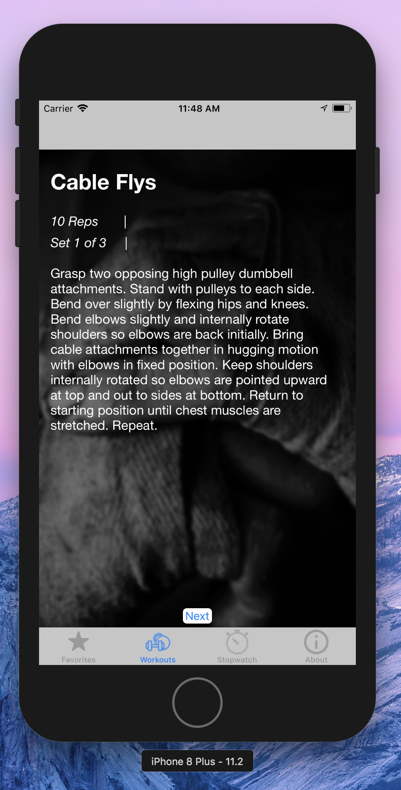
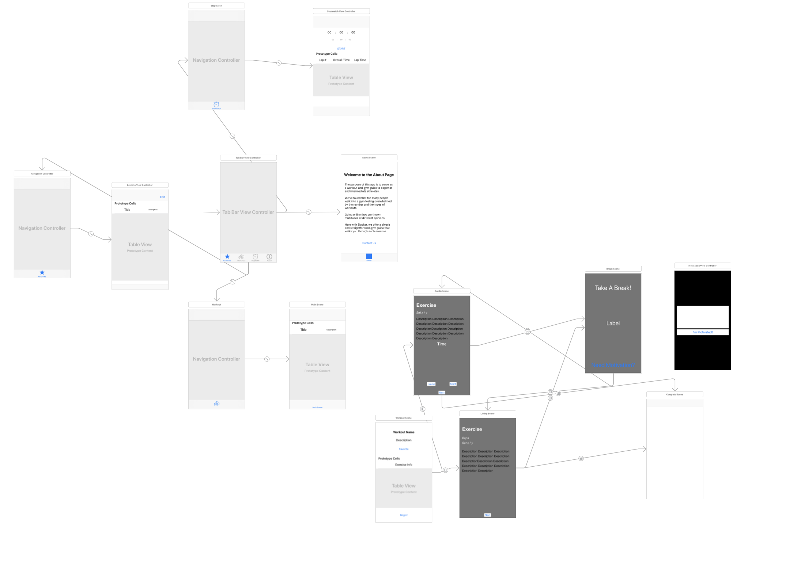

# GymApp

### Overview
GymApp, nicknamed "slacker" is an IOS app that guides you through your workout. This app specifically targets beginner athletes who don't know what exercises they should do, how to do them, and for how long. 

### Why
Myself and a group of 3 others took and IOS class and thought it would be fun to make an app of our own that is both useful but can also be presnted during interviews.

### Details
* Hosts a list of **pre made workouts**
    * this includes lifting, cardio, and HIT workouts
    * workouts are pulled down from a server and can be updated by the developper at any moment
    * workouts can be favorited for easy future reference

* The workouts guide the athlete through the **exercises**
    * Reps and sets are are tracked in order to keep you accountable
    * Every exercise has a friendly description of how to complete it

* **Additionally** there is a built in timer and stopwatch.

#### Design

